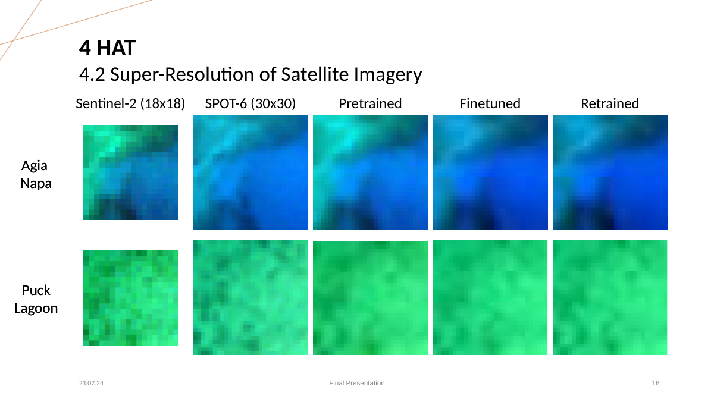
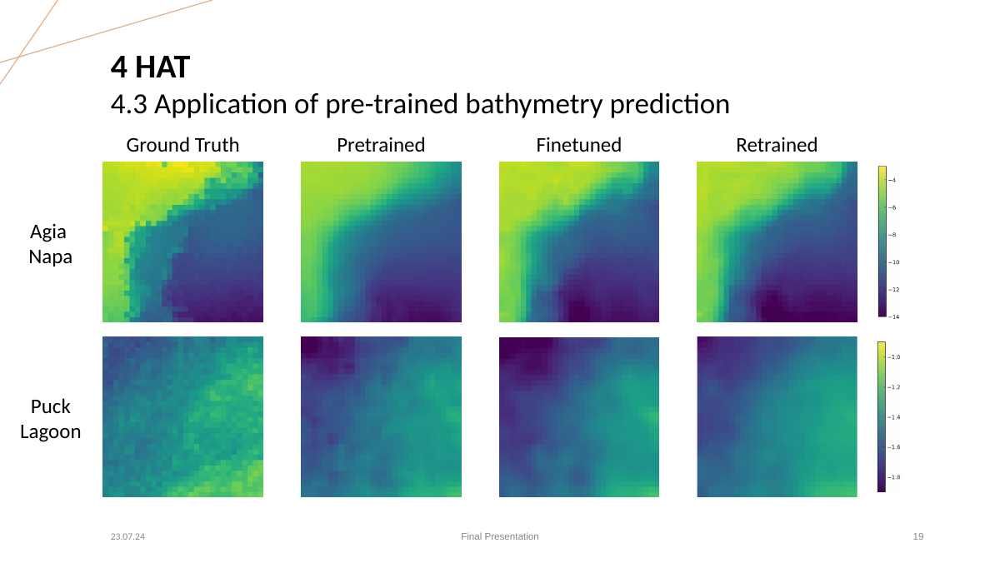

# Super-Resolution of Ocean Imagery for Improving Bathymetry Prediction

A computer vision project on **satellite image super-resolution with the Hybrid Attention Transformer (HAT)** using the MagicBathyNet dataset, followed by evaluation of the impact of the super-resolved imagery on downstream bathymetry prediction.

> This portfolio version focuses on **HAT-based satellite image super-resolution** and its downstream bathymetry application.  
> The **MagicBathyNet dataset and its associated normalization parameters are external project resources** used by this work.  
> The separate bathymetry-prediction implementation is not included in this repository; it is referenced below as the original MagicBathyNet codebase.

---

## Overview

Satellite imagery provides broad spatial coverage for shallow-water mapping, but spatial resolution limits the quality of downstream bathymetry estimation.

The project investigates whether a learned super-resolution model can improve low-resolution satellite imagery before bathymetry prediction.

The final portfolio focuses on:

1. **Super-resolution of low-resolution satellite imagery**
2. **Application of bathymetry prediction to the super-resolved imagery**


---

## Pipeline

```text
MagicBathyNet
     │
     ▼
Sentinel-2 imagery
18 × 18 pixels / 10 m
     │
     ▼
Location-specific normalization
     │
     ▼
HAT
Hybrid Attention Transformer
     │
     ▼
2× Super-Resolution
128 × 128 output
     │
     ▼
SPOT-6 reference
30 × 30 pixels / 6 m
     │
     ▼
PSNR / SSIM evaluation
     │
     ▼
Downstream bathymetry prediction
```

---

## Dataset

The project uses **MagicBathyNet**, a multimodal remote-sensing dataset containing Sentinel-2, SPOT-6, aerial imagery, bathymetry and pixel-level annotations.

For the satellite SR task:

| Data | Resolution | Patch |
|---|---:|---:|
| Sentinel-2 | 10 m | 18 × 18 |
| SPOT-6 | 6 m | 30 × 30 |

The dataset used in this project is the **MagicBathyNet dataset**.

For downloading the dataset and a detailed explanation of it, please visit the
[MagicBathy Project website](https://www.magicbathy.eu/magicbathynet.html).

The normalization parameters used by the preprocessing pipeline are also provided
with the dataset. The project uses the corresponding location-specific parameters
for Sentinel-2 and SPOT-6 imagery.

```text
agia_napa
├── norm_param_s2_an.txt
└── norm_param_spot6_an.txt

puck_lagoon
├── norm_param_s2_pl.txt
└── norm_param_spot6_pl.txt
```

The original MagicBathyNet project and related code are available at:

https://github.com/pagraf/MagicBathyNet

**Paper:**  
P. Agrafiotis, L. Janowski, D. Skarlatos, B. Demir,  
*MagicBathyNet: A Multimodal Remote Sensing Dataset for Bathymetry Prediction and Pixel-based Classification in Shallow Waters*, arXiv:2405.15477, 2024.

### Dataset structure used by this project

```text
datasets/
└── data/
    ├── agia_napa/
    │   └── img/
    │       ├── s2/
    │       └── spot6/
    └── puck_lagoon/
        └── img/
            ├── s2/
            └── spot6/
```

Please transfer the format from txt to npy and reconstruct the normalization parameters as the following:

```text
configs/norm_params
    ├── norm_param_bathy.npy
    ├── norm_param_s2_an.npy
    ├── norm_param_s2_pl.npy
    ├── norm_param_spot6_an.npy
    └── norm_param_spot6_pl.npy
```
---

## Model: HAT

The project uses the **Hybrid Attention Transformer (HAT)** for image super-resolution.

HAT combines:

- Window-based self-attention
- Overlapping Cross-Attention
- Residual Hybrid Attention Groups
- PixelShuffle-based reconstruction

The implementation is based on:

> X. Chen, X. Wang, J. Zhou, Y. Qiao, C. Dong,  
> *Activating More Pixels in Image Super-Resolution Transformer*,  
> CVPR 2023.

The HAT architecture itself is not claimed as original project work. The project contribution is the adaptation, training, preprocessing and evaluation of HAT for the MagicBathyNet satellite imagery.

---

## Trained Weights

The trained HAT checkpoints are provided in the following Google Drive folder:

**Trained HAT weights:**  
https://drive.google.com/drive/u/0/folders/10Mwt8NVis9aIQbLSpNfHDvoWxzmY3L6H

For reproducible inference, download the desired checkpoint and pass its local path to `sr_inference.py`.

Example:

```bash
python sr_inference.py \
    --location agia_napa \
    --weights /path/to/hat_retrained_2x.pth
```

---

## Inference

Unlike a generic image super-resolution demo, the project inference pipeline intentionally uses the **MagicBathyNet DataLoader**.

This is important because the original training pipeline applies location-specific preprocessing.

### Agia Napa

```bash
python sr_inference.py \
    --location agia_napa \
    --weights /path/to/weights.pth \
    --root-dir ./datasets/data/ \
    --output-dir ./results/agia_napa
```

### Puck Lagoon

```bash
python sr_inference.py \
    --location puck_lagoon \
    --weights /path/to/weights.pth \
    --root-dir ./datasets/data/ \
    --output-dir ./results/puck_lagoon
```

The script:

1. Loads MagicBathyNet through the project DataLoader
2. Selects the requested geographic location
3. Applies the corresponding Sentinel-2 normalization
4. Resizes the input to 64 × 64
5. Runs HAT
6. Produces a 2× 128 × 128 super-resolved image
7. Computes PSNR and SSIM against the SPOT-6 reference
8. Denormalizes the output
9. Writes a GeoTIFF while preserving the source GeoTIFF metadata

The preprocessing is intentionally kept consistent with the training pipeline.

---

## Training

The HAT training configuration used in the project includes:

```text
Input size:       64 × 64
Output scale:     2×
Window size:      16
Embedding dim:    180
HAT/RHAG groups:  12
Depth per group:  6
Attention heads: 6 per block
MLP ratio:        2
Upsampler:        PixelShuffle
Residual conv:    1conv
Loss:             L1
Optimizer:        Adam
```

The HAT architecture is implemented in:

```text
models/
└── hat_arch.py
```

The project training pipeline is implemented in:

```text
train.py
```

--

## Results

### Satellite Image Super-Resolution

The final project results for the retrained HAT model are:

| Location | Method | PSNR ↑ | SSIM ↑ |
|---|---|---:|---:|
| Agia Napa | Bilinear | 24.0319 dB | 0.8480 |
| Agia Napa | HAT retrained | **32.8407 dB** | **0.9404** |
| Puck Lagoon | Bilinear | 16.2706 dB | 0.7121 |
| Puck Lagoon | HAT retrained | **40.5780 dB** | **0.9598** |

The qualitative results:



The input is Sentinel-2 imagery, with SPOT-6 providing the higher-resolution reference.

The final presentation also evaluated pretrained and finetuned HAT models. The retrained model achieved the strongest HAT result on both locations.

---

### Downstream Bathymetry Prediction

The super-resolved satellite imagery was subsequently used for bathymetry prediction.

| Location | Method | RMSE ↓ | MAE ↓ | Std. Dev. ↓ |
|---|---|---:|---:|---:|
| Agia Napa | Bilinear | 1.532 m | 1.151 m | 1.085 m |
| Agia Napa | HAT retrained | **0.880 m** | **0.567 m** | **0.798 m** |
| Puck Lagoon | Bilinear | 2.758 m | 2.293 m | 1.508 m |
| Puck Lagoon | HAT retrained | **0.800 m** | **0.404 m** | **0.798 m** |



The bathymetry-prediction implementation itself is **not included in this repository**. It is based on the MagicBathyNet codebase and can be found at:

https://github.com/pagraf/MagicBathyNet

---

## Project Contributions

**Portfolio Author:** Yeqiao Xu

This repository presents the work on HAT-based satellite image
super-resolution for ocean imagery.

The original project was conducted as a team project. The dataset loading
and preprocessing components retained in this repository were developed
jointly with:

- Maximilian Kromer
- Yeqiao Xu
- Niklas Schmolenski

The HAT-based model adaptation, training, inference, evaluation, and
portfolio implementation presented here were carried out by **Yeqiao Xu**.

The underlying MagicBathyNet dataset and its original bathymetry-prediction implementation belong to the original dataset authors.

## References

### MagicBathyNet

P. Agrafiotis, L. Janowski, D. Skarlatos, B. Demir.  
*MagicBathyNet: A Multimodal Remote Sensing Dataset for Bathymetry Prediction and Pixel-based Classification in Shallow Waters.*  
arXiv:2405.15477, 2024.

Dataset website:  
https://www.magicbathy.eu/magicbathynet.html

Official repository:  
https://github.com/pagraf/MagicBathyNet

Paper:  
https://arxiv.org/abs/2405.15477

### HAT

X. Chen, X. Wang, J. Zhou, Y. Qiao, C. Dong.  
*Activating More Pixels in Image Super-Resolution Transformer.*  
CVPR 2023.

https://github.com/XPixelGroup/HAT

---

## License

See `LICENSE` for the project license.
